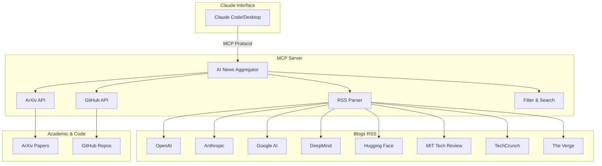
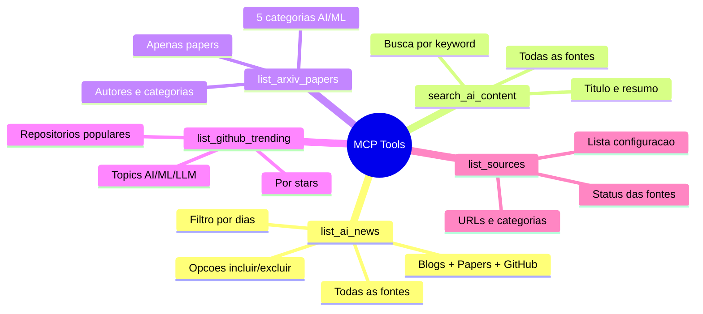
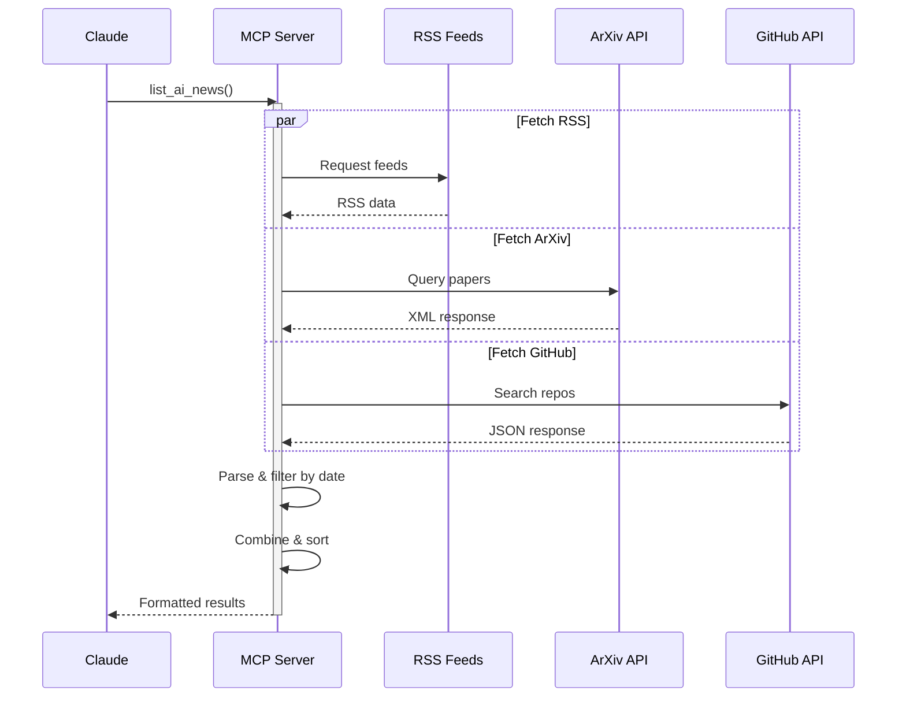

# AI News Aggregator

Agrega notícias, papers acadêmicos e repositórios sobre Inteligência Artificial de múltiplas fontes confiáveis.

[](https://modelcontextprotocol.io)
[](https://fastapi.tiangolo.com)
[](https://python.org)
[](LICENSE)

---

## Dois Modos de Uso

Este projeto oferece **duas formas** de acessar as notícias de IA:

### 1. MCP Server (Local) - Claude Code/Desktop

```bash
# Servidor MCP via stdio para uso local
python server.py
```

- Para Claude Code (VS Code) e Claude Desktop
- Protocolo MCP via stdin/stdout
- 5 tools: `list_ai_news`, `search_ai_content`, `list_arxiv_papers`, `list_github_trending`, `list_sources`
- Configure via `.mcp.json` na raiz do projeto

### 2. REST API (Cloud) - Deploy Público

```bash
# API REST FastAPI para servidor remoto
python api.py
# Acesse: http://localhost:8000/docs
```

- Deploy em Render, Railway, Fly.io (gratuito)
- Endpoints HTTP padrão: `/news`, `/search`, `/papers`, `/github`
- Documentação automática (Swagger/ReDoc)
- CORS habilitado, acesso público
- **Ver guia completo:** [DEPLOY.md](DEPLOY.md)

---

## Features

- **10 Fontes de Conteúdo**: 8 blogs especializados + ArXiv + GitHub
- **Filtro Temporal**: Conteúdo das últimas 2 semanas (configurável)
- **Busca por Palavra-chave**: Pesquisa em títulos e resumos
- **Papers Acadêmicos**: ArXiv (cs.AI, cs.LG, cs.CL, cs.CV, stat.ML)
- **Repositórios GitHub**: Trending AI/ML repositories
- **5 Tools MCP**: Acesso completo via Claude Code/Desktop

---

## Arquitetura



---

## Tools Disponíveis



---

## Instalação

### Pré-requisitos

- Python 3.10 ou superior
- Claude Code ou Claude Desktop

### Passo 1: Instalar Dependências

```bash
pip install -r requirements.txt
```

**Dependências:**
- `mcp` - Framework MCP
- `feedparser` - Parse RSS feeds
- `requests` - HTTP requests para APIs
- `aiohttp` - Async HTTP (futuro)

### Passo 2: Configurar MCP

#### Para Claude Code

Crie `.mcp.json` na raiz do projeto:

```json
{
  "mcpServers": {
    "ai-news": {
      "command": "python",
      "args": ["server.py"]
    }
  }
}
```

Recarregue: `Ctrl+Shift+P` → "Developer: Reload Window"

#### Para Claude Desktop

Edite `claude_desktop_config.json`:

**Windows:** `%APPDATA%\Claude\claude_desktop_config.json`
**Mac/Linux:** `~/.config/Claude/claude_desktop_config.json`

```json
{
  "mcpServers": {
    "ai-news": {
      "command": "python",
      "args": ["/caminho/completo/para/server.py"]
    }
  }
}
```

Reinicie o Claude Desktop.

---

## Uso

### Exemplos de Comandos

**Listar todo conteúdo:**
```
"Liste as últimas notícias de IA"
"Mostre papers e notícias recentes de AI"
```

**Buscar por tópico:**
```
"Busque conteúdo sobre GPT-5"
"Encontre papers sobre transformers"
"Procure repositórios sobre LLM"
```

**Conteúdo específico:**
```
"Liste apenas papers do ArXiv"
"Mostre repositórios trending do GitHub"
"Quais as fontes disponíveis?"
```

**Filtro temporal:**
```
"Notícias dos últimos 7 dias"
"Papers da última semana"
```

---

## Fluxo de Dados



---

## Fontes Configuradas

### Blogs RSS (8 fontes)

| Fonte | Tipo | Cobertura |
|-------|------|-----------|
| OpenAI Blog | RSS | GPT, ChatGPT, DALL-E |
| Anthropic News | RSS | Claude, Constitutional AI |
| Google AI Blog | RSS | Gemini, Bard, research |
| DeepMind Blog | RSS | AlphaFold, AlphaGo, research |
| Hugging Face | RSS | Open-source models, datasets |
| MIT Tech Review | RSS | Deep analysis, trends |
| TechCrunch AI | RSS | Startups, funding, market |
| The Verge AI | RSS | Consumer tech, products |

### Papers Acadêmicos (ArXiv)

**Categorias:**
- `cs.AI` - Artificial Intelligence
- `cs.LG` - Machine Learning
- `cs.CL` - Computation and Language (NLP)
- `cs.CV` - Computer Vision
- `stat.ML` - Machine Learning (Statistics)

**Output includes:** Título, autores, resumo, categorias, link

### Repositórios (GitHub)

**Topics:** artificial-intelligence, machine-learning, deep-learning, llm, transformers, gpt, language-model

**Sorted by:** Stars (descendente)

**Output includes:** Nome, descrição, stars, linguagem, topics, link

---

## Estrutura do Projeto

```
ai-news-aggregator/
├── server.py              # Servidor MCP (stdio)
├── api.py                 # API REST (FastAPI)
│
├── requirements.txt       # Dependências
├── .mcp.json             # Config Claude Code
├── .gitignore            # Segurança
│
├── README.md             # Documentação principal
├── DEPLOY.md             # Guia de deploy
├── STRUCTURE.md          # Estrutura detalhada
├── LICENSE               # MIT License
│
├── Procfile              # Render/Heroku
├── render.yaml           # Render config
├── railway.json          # Railway config
├── Dockerfile            # Container Docker
└── runtime.txt           # Python version
```

**Ver:** [STRUCTURE.md](STRUCTURE.md) para descrição detalhada de cada arquivo.

---

## REST API Endpoints

Quando a API está rodando (local ou em servidor), você pode acessar:

| Endpoint | Método | Descrição |
|----------|--------|-----------|
| `/` | GET | Info da API |
| `/health` | GET | Health check |
| `/news` | GET | Todas as notícias (blogs + papers + GitHub) |
| `/search?q=keyword` | GET | Busca por palavra-chave |
| `/papers` | GET | Apenas papers do ArXiv |
| `/github` | GET | Apenas repos do GitHub |
| `/sources` | GET | Lista todas as fontes |
| `/docs` | GET | Documentação Swagger |
| `/redoc` | GET | Documentação ReDoc |

### Exemplos de uso:

```bash
# Últimas notícias (14 dias por padrão)
curl https://sua-api.com/news

# Notícias dos últimos 7 dias, limite 20
curl https://sua-api.com/news?days=7&limit=20

# Buscar por "GPT"
curl https://sua-api.com/search?q=GPT&days=14

# Papers dos últimos 3 dias
curl https://sua-api.com/papers?days=3&max_results=20

# Trending repos da última semana
curl https://sua-api.com/github?days=7
```

**Deploy:** Ver [DEPLOY.md](DEPLOY.md) para instruções completas de como fazer deploy gratuitamente.

---

## MCP Tools Reference

### Tools para Claude Code/Desktop

#### `list_ai_news`

Lista todo conteúdo de IA: blogs, papers e repositórios.

**Parâmetros:**
- `days` (int, default: 14) - Número de dias retroativos
- `include_papers` (bool, default: true) - Incluir papers ArXiv
- `include_github` (bool, default: true) - Incluir repos GitHub

**Retorna:** Lista formatada com centenas de itens

#### `search_ai_content`

Busca por palavra-chave em todo conteúdo.

**Parâmetros:**
- `keyword` (string, required) - Termo de busca
- `days` (int, default: 14) - Número de dias

**Retorna:** Itens filtrados contendo keyword

#### `list_arxiv_papers`

Lista apenas papers acadêmicos do ArXiv.

**Parâmetros:**
- `days` (int, default: 14) - Número de dias
- `max_results` (int, default: 50) - Máximo de papers

**Retorna:** Papers com autores, resumo, categorias

#### `list_github_trending`

Lista repositórios trending de IA.

**Parâmetros:**
- `days` (int, default: 14) - Número de dias

**Retorna:** Repos com stars, linguagem, topics

#### `list_sources`

Lista todas as fontes configuradas.

**Parâmetros:** Nenhum

**Retorna:** Status de todas as fontes (blogs, ArXiv, GitHub)

---

## Desenvolvimento

### Adicionar Nova Fonte RSS

Edite `FONTES_RSS` em `server.py`:

```python
"nova_fonte": {
    "nome": "Nome da Fonte",
    "url": "https://fonte.com/rss.xml",
    "ativa": True
}
```

### Adicionar Categoria ArXiv

Edite `ARXIV_CATEGORIAS` em `server.py`:

```python
ARXIV_CATEGORIAS = ["cs.AI", "cs.LG", "cs.CL", "cs.CV", "stat.ML", "cs.RO"]
```

### Testar Localmente

```bash
python server.py
```

### Testar com MCP Inspector

```bash
npx @modelcontextprotocol/inspector python server.py
```

Interface web: `http://localhost:6274`

---

## Performance

- **Cache:** Feeds RSS fazem cache natural via HTTP headers
- **Rate Limits:** Respeitados via delays entre requests
- **Concorrência:** Busca paralela de múltiplas fontes
- **Timeout:** 30s por request

### Métricas Típicas

- Blogs RSS: ~100 notícias (2 semanas)
- ArXiv: ~50 papers (2 semanas)
- GitHub: ~30 repos (2 semanas)
- **Total: ~180+ itens** agregados em ~10-15 segundos

---

## Troubleshooting

**Erro: "Module 'requests' not found"**
```bash
pip install requests
```

**Claude não vê o servidor**
- Verifique caminho em `.mcp.json`
- Recarregue Claude Code
- Teste: `python server.py`

**ArXiv/GitHub não retorna resultados**
- Check internet connection
- APIs podem ter rate limits temporários
- Tente aumentar `days` parameter

**Timeout errors**
- Algumas fontes podem estar lentas
- Servidor continua com outras fontes
- Erros são logados mas não interrompem

---

## Contributing

Contribuições são bem-vindas via Pull Requests.

**Guidelines:**
- Mantenha código documentado
- Adicione tests para novas features
- Siga style guide Python (PEP 8)
- Atualize README se adicionar tools

---

## License

MIT License - Ver arquivo [LICENSE](LICENSE)

---

## Autor

**Desenvolvido por [Laura Mattos](https://www.linkedin.com/in/lauramattosc/)**

---

## Créditos

- **MCP Framework:** [Model Context Protocol](https://modelcontextprotocol.io)
- **RSS Parsing:** [feedparser](https://feedparser.readthedocs.io/)
- **ArXiv API:** [arXiv API Documentation](https://arxiv.org/help/api)
- **GitHub API:** [GitHub REST API](https://docs.github.com/en/rest)
- **FastAPI:** [FastAPI Documentation](https://fastapi.tiangolo.com)

---

## Support

Para issues, bugs ou feature requests, abra uma issue no repositório.

**Verificações básicas:**
1. Dependências instaladas: `pip install -r requirements.txt`
2. Servidor inicia: `python server.py`
3. Config correta: `.mcp.json` com caminho válido
4. Claude recarregado após mudanças

---

<div align="center">

**AI News Aggregator**

Mantendo a comunidade atualizada sobre Inteligência Artificial

Desenvolvido por [Laura Mattos](https://www.linkedin.com/in/lauramattosc/)

</div>
